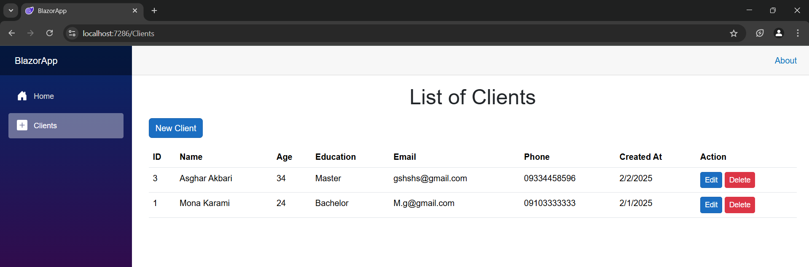
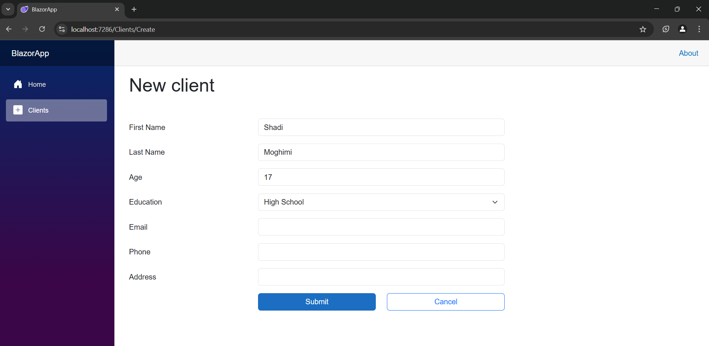
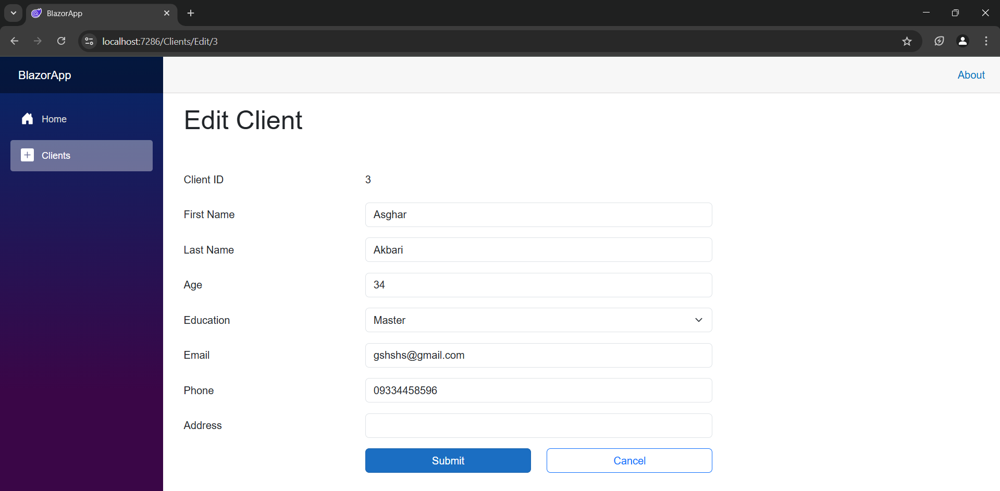
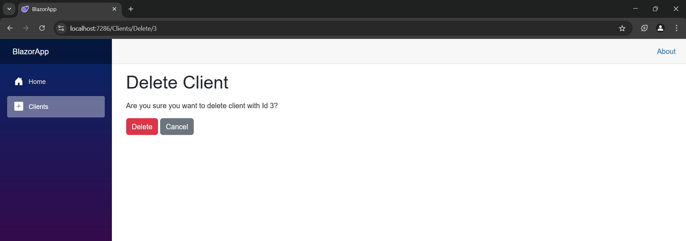
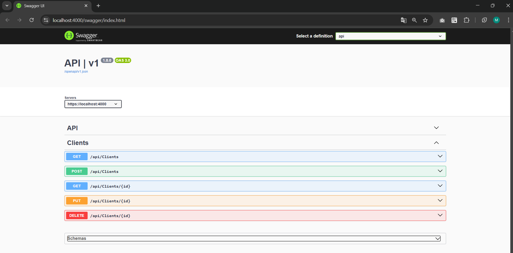

# SimpleBlazorFormWebApp

## Introduction
SimpleBlazorFormWebApp is a web application built using **Blazor WebAssembly** for the frontend and **ASP.NET Core Web API** for the backend. It is designed to demonstrate form handling, authentication, and authorization features using modern web technologies.

The project consists of two main components:
- **API**: The backend service built with ASP.NET Core Web API.
- **BlazorApp**: The frontend application built with Blazor WebAssembly (standalone mode).

## Setup and Usage

### Installed NuGet Packages
The following NuGet packages are used in this project:
- `Microsoft.AspNetCore.Components.WebAssembly`
- `Microsoft.AspNetCore.Identity.EntityFrameworkCore`
- `Microsoft.AspNetCore.OpenApi`
- `Microsoft.EntityFrameworkCore.SqlServer`
- `Microsoft.EntityFrameworkCore.Tools`
- `Swashbuckle.AspNetCore.SwaggerUI`

## Authentication and Authorization
Authentication and authorization are implemented at the start of the project. **Swagger** is used for API documentation and testing purposes.

## UI view

### List of Clients

### Create Client

### Edit Client

### Delete Client

### Swagger View

---

> **Note**: To run the project, ensure that you have the required .NET SDK installed and run both the API and BlazorApp projects simultaneously.

